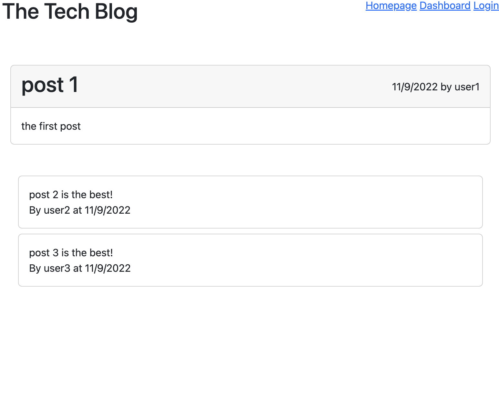
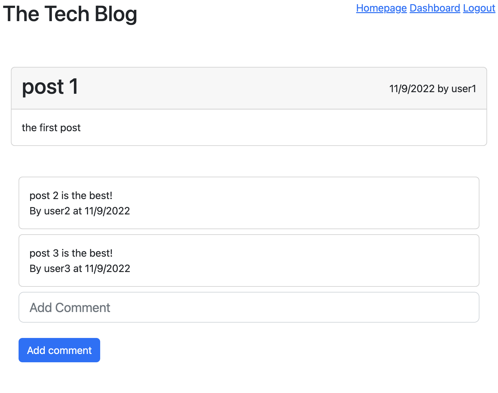

# Full Stack Blog Forum
Repo contains a full stack public blog site built using an Express API and Sequelize to interact with a MySQL database. The front end uses Handlebars template engine. Users are able to create posts, update and delete their own posts (only presented with options to do so. need to lock API down more), and comment on other users posts.

This repository utilizes

JavaScript
Node
npm
MySQL
Sequelize
HandleBars
Express

[Deployed App](https://blog-forum.herokuapp.com/)


## Installation 
You can either check out the deployed app above or follow the below instructions below.
Make sure you have node installed. Install dependencies
```sh
npm install
```
You will need mysql installed. Then run 
```sh
source db/schema.sql
```
from within the mysql shell at the root directory. This creates the db.

You will need to include a .env file with the db name and your username and pw, which sequelize will use to connect. 

In order to seed the db run
```sh
npm run seed
```

## Usage 
In order to start the server run
```sh
npm start
```
Start by creating an account. Then create a post in your dashboard. Go comment on some other posts! But hurry, sessions only last 1 minute!

## Images
One interesting functionaility implemented easily using handlebars is the ability to add comments only when logged in. In the template we write
```HTML
{{#if logged_in}}
<div class="form-outline mb-4">
    <input type="input" id="comment-text" class="form-control form-control-lg" placeholder="Add Comment"/>
</div>
<div class="btn btn-primary" id="add-comment">Add comment</div>
<script src="/js/add-comment.js"></script>
{{/if}}
```
and this adds the elements and scripts necessary if you are logged in.




## License

Refer to the license in the Github repo.

